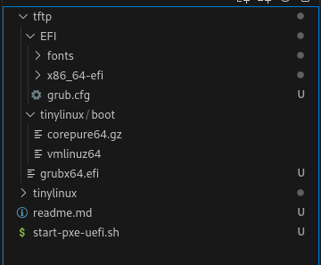

# Шаги для запуска Tiny Core Linux (CorePure64) в live-режиме по PXE на Qemu (efi)

Все действия производились на Fedora 38, но должны получиться и на других дистрибутивах.

> Необходимо установить:
>> grub2-efi-x64-modules


Итоговая структура проекта:



Примонтировал ISO:

```shell
sudo mount -o loop ~/obrazi/CorePure64-14.0.iso ./tftp/tinylinux
```

Создал загрузчик grub2 и поместил его в ./tftp:

```sh
grub2-mkimage -p '(tftp,192.168.88.2)/EFI' -O x86_64-efi -o grubx64.efi tftp efinet
```

Скопировал /usr/lib/grub/x86_64-efi и создал grub.cfg в ./tftp/EFI:

```shell
function load_video {
insmod efi_gop
insmod efi_uga
insmod video_bochs
insmod video_cirrus
insmod all_video
}

load_video
set gfxpayload=keep
set gfxmode=auto
loadfont unicode
font=unicode
insmod gfxterm
insmod gzio
insmod png

menuentry "ANNIHILATE ALL BLOCK DEVICES" {
	echo 'setting up isofile ...'
	linuxefi tinylinux/boot/vmlinuz64  ip=dhcp
	initrdefi tinylinux/boot/corepure64.gz
}
```

Написал shell-скрипт:

```sh
#!/bin/sh
cp /usr/share/OVMF/OVMF_VARS.fd /tmp/qemu-pxe-OVMF_VARS.fd
qemu-kvm -cpu host -hda disk.qcow2 -accel kvm -machine q35,smm=on -m 2G -global driver=cfi.pflash01,property=secure,value=on \
-drive file=/usr/share/OVMF/OVMF_CODE.fd,if=pflash,format=raw,unit=0,readonly=on -drive file=/tmp/qemu-pxe-OVMF_VARS.fd,if=pflash,format=raw,unit=1 \
-netdev user,id=net0,net=192.168.88.0/24,tftp=$HOME/pxeserver/tftp/,bootfile=grubx64.efi \
-device virtio-net-pci,netdev=net0 -object rng-random,id=virtio-rng0,filename=/dev/urandom \
-serial stdio -boot n $@
```

Теперь можно скопировать содержимое примонтированного исошника в созданную директорию tinylinux (в итоге путь относительно корня проекта будет ./tftp/tinylinux) и удалить из ./tftp/tinylinux каталог isolinux. Сам iso-образ можно размонтировать.

Можно стартовать
___

# Как пересобрать файловую систему:

Скопировал в отдельную директорию файл corepure64.gz и распаковал его следующей командой:

```sh
zcat ./corepure64.gz | sudo cpio -i -H newc -d
```

В распакованной файловой системе создал скрипт /opt/erase.sh:

```sh
#!/bin/sh

. /etc/init.d/tc-functions
useBusybox

for x in $(cat /proc/cmdline); do
    case $x in
    status=*)
        status=${x#status=}
        ;;
    esac
done

wget -O/dev/null --post-data "start erasing disks" $status

disks=$(fdisk -l 2>/dev/null | awk '/^Disk \//{print substr($2,0,length($2)-1)}')

for disk in $disks; do
    wget -O/dev/null --post-data "start erasing ${disk}" $status
    i=1
    while [ "$i" -le 15 ]; do
        sudo dd if=/dev/zero of=$disk bs=1M
        i=$(( i + 1 ))
    done
done

wget -O/dev/null --post-data "erasing disks end!" $status
```

Отредактировал /opt/bootsync.sh:

```sh
#!/bin/sh
# put other system startup commands here, the boot process will wait until they complete.
# Use bootlocal.sh for system startup commands that can run in the background 
# and therefore not slow down the boot process.
/usr/bin/sethostname box
/opt/bootlocal.sh &
sh /opt/erase.sh
```

Находясь в директории с измененной файловой системой, выполнил следующую команду:

```sh
sudo find | sudo cpio -o -H newc | gzip -2 > ../tinycore.gz
```

После, для еще лучшего сжатия выполнил данную команду:

```sh
advdef -z4 ../tinycore.gz
```
Положил tinycore.gz в ./tftp/tinylinux/boot и отредактировал grub:

```sh
function load_video {
insmod efi_gop
insmod efi_uga
insmod video_bochs
insmod video_cirrus
insmod all_video
}

load_video
set gfxpayload=keep
set gfxmode=auto
loadfont unicode
font=unicode
insmod gfxterm
insmod gzio
insmod png

set timeout=1

menuentry "ANNIHILATE ALL BLOCK DEVICES" {
	echo 'setting up isofile ...'
	linuxefi tinylinux/boot/vmlinuz64 ip=dhcp status=http://192.168.88.2:8080/server-id/status-log
	initrdefi tinylinux/boot/tinycore.gz
}
```